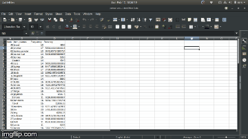

🛍️ AI-Based Shopping Assistant
This project was developed for Codeutsava 3.0 at NIT Raipur (2019).
Its main goal is to create an AI-powered recommendation system for online shopping using unsupervised machine learning (clustering).

🧠 Project Overview
Uses clustering to group items based on a user's purchase history.

When a user searches for a product, the model:

Identifies the most relevant cluster.

Recommends similar items from that cluster under the "Things You May Like" section.

Additionally, it also displays results for variations of the searched item (not part of the core recommendation logic, but added for better UX).

⚙️ Requirements
Python 3.6

Libraries:

NumPy

Pandas

OpenCV

scikit-learn

matplotlib

Install using pip:

bash
Copy
Edit
pip install numpy pandas opencv-python scikit-learn matplotlib
📊 Dataset
Custom dataset: person.csv

Currently supports 100 items.

To expand the dataset:

Open getDataset.py

Add more items to the item list.

Delete person.csv and dataset.csv

Run:

bash
Copy
Edit
python3 getDataset.py
🚀 Usage
Clone the repository:

bash
Copy
Edit
git clone https://github.com/riti1302/AI-Based-Shopping-Assistant
cd AI-Based-Shopping-Assistant
Run the main script:

bash
Copy
Edit
python3 main.py
To expand the item database, add more data files to the data/ directory.

🎯 Output

  

📌 Notes
This project is a prototype and can be enhanced further with:

Larger datasets

User profiling

Integration with front-end interfaces

Deep learning-based recommendations
